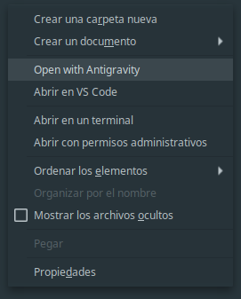

# nemo-open-with-antigravity




Nemo, the cinnamon DE (Desktop Environment) file manager, supports adding actions and scripts easily by adding a config file in `~/.local/share/nemo`.
So, for adding the `open in vscode` option, you just need to place the file `vscode.nemo_action` in the `actions` folder in the mentioned directory.

(description based on [this repo](https://github.com/mhsattarian/nemo-open-in-vscode))

# Installation


```shell
wget https://raw.githubusercontent.com/gNOR-mu/nemo-open-with-antigravity/refs/heads/main/antigravity.nemo_action -O ~/.local/share/nemo/actions/antigravity.nemo_action
```

Or, clone this repository and run:

```shell
cp antigravity.nemo_action ~/.local/share/nemo/actions
```